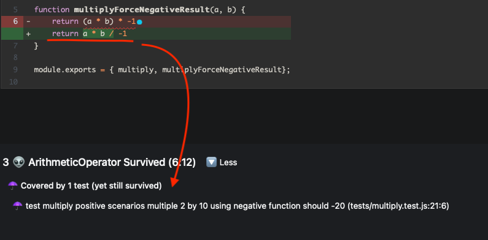

# jest-test-mutation


## jest
https://jestjs.io

## stryker
https://stryker-mutator.io

**Summary**: Use Stryker to identify tests that do not cover various logic or conditional mutations.

### Mutations
**original logic**
```
function sum(a, b) { return a + b)}
// sum(2+2)
// output: 4 
// test is expecting 4
// PASS
```

**mutation**
```
function sum(a, b) { return a - b)}
// sum(2+2)
// output: 0
// test is expecting 4
// FAIL
```

Stryker takes your code, mutates and runs your tests against the mutated logic, returning the results of those additional tests. 

**mutants**
* are generated based off operators or logic provided in functions. e.g
```
#3. [NoCoverage] ArithmeticOperator
src/multiply.js:6:12
-       return (a * b) * -1 > the original logic
+       return a * b / -1 > the mutated logic aka the mutant

#4. [NoCoverage] ArithmeticOperator
src/multiply.js:6:13
-       return (a * b) * -1 > the original logic
+       return (a / b) * -1 > the mutated logic aka the mutant
```

Mutation variations & support can be found here https://stryker-mutator.io/docs/mutation-testing-elements/supported-mutators/

**killed**
* if a mutant is covered a test, the mutant is killed

**surivor mutant**
* test passed even when changes were made
* if you have these, it means your test is not handling the mutated (different) logic

### Reporting

Stryker also provides in-built reporting, highlight a stack of info. A `html` sample is below, showing the mutation of a function:



## TODO
* ~~import mutation logic for tests~~
* convert JS code to TS
* explore jest mock + spy functionality


